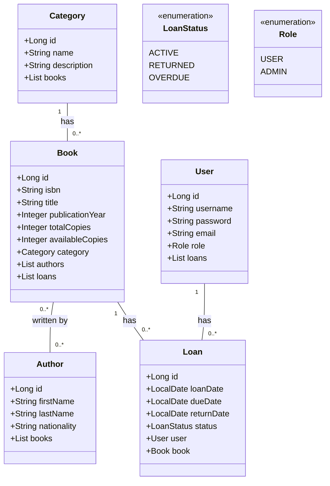

# Booking Library API

[](https://openjdk.java.net/)
[](https://spring.io/projects/spring-boot)
[](LICENSE)
[]()

> Une API REST robuste et sécurisée pour la gestion complète d'une bibliothèque moderne, développée avec Spring Boot. Offrant un système d'emprunts intelligent avec règles métier avancées.

## 📋 Table des matières

- [📖 Description](#-description)
- [✨ Fonctionnalités](#-fonctionnalités)
- [🛠️ Technologies utilisées](#️-technologies-utilisées)
- [📋 Prérequis](#-prérequis)
- [🚀 Installation](#-installation)
- [⚙️ Configuration](#️-configuration)
- [📡 Utilisation](#-utilisation)
- [🗄️ Base de données](#️-base-de-données)
- [🧪 Tests](#-tests)
- [🚢 Déploiement](#-déploiement)
- [🤝 Contribution](#-contribution)
- [📄 Licence](#-licence)

## 📖 Description

Cette API REST Spring Boot révolutionne la gestion des bibliothèques en offrant une solution complète et sécurisée. Développée avec les meilleures pratiques de l'industrie, elle intègre un système d'emprunts sophistiqué avec validation automatique, calculs de pénalités et gestion fine des disponibilités. Parfaite pour les bibliothèques modernes cherchant à digitaliser leurs opérations.

## ✨ Fonctionnalités

### 🔐 Sécurité et Authentification
- Authentification HTTP Basic robuste
- Système de rôles (USER/ADMIN) avec autorisations granulaires
- Protection CSRF et validation des entrées

### 📚 Gestion documentaire complète
- **CRUD complet** sur toutes les entités
- Gestion des catégories avec hiérarchie
- Profils d'auteurs détaillés (nom, prénom, nationalité)
- Gestion des exemplaires multiples par livre
- Suivi des disponibilités en temps réel

### 👥 Gestion utilisateurs avancée
- Profils utilisateurs avec rôles
- Historique complet des emprunts
- Gestion des droits d'accès

### 📖 Système d'emprunts intelligent
- **Limite d'emprunts** : Maximum 3 emprunts actifs par utilisateur
- **Vérification automatique** de disponibilité des livres
- **Prévention des doubles emprunts** : Un utilisateur ne peut emprunter qu'un exemplaire par livre
- **Calcul automatique des échéances** : 14 jours par défaut
- **Gestion des pénalités** : 0,50€ par jour de retard
- **Statuts d'emprunts** : Actif, Retourné, En retard

### 🔍 Fonctionnalités de recherche
- Recherche par ISBN avec validation
- Recherche par titre (partiel ou complet)
- Recherche par nom d'auteur
- Filtres avancés et pagination

### ✅ Validation et intégrité
- Validation Bean Validation complète
- Contraintes d'intégrité référentielle
- Gestion des erreurs détaillée

### 🗄️ Base de données
- Base H2 en mémoire pour le développement
- Support des bases externes (PostgreSQL, MySQL)
- Migrations automatiques avec Flyway (optionnel)
- Données de démonstration incluses

## 🛠️ Technologies utilisées

| Technologie | Version | Description | Utilisation |
|-------------|---------|-------------|-------------|
| ☕ **Java** | 17+ | Langage principal | Développement backend |
| 🚀 **Spring Boot** | 3.2.0 | Framework | Structure applicative |
| 🗃️ **Spring Data JPA** | - | ORM | Accès base de données |
| 🔐 **Spring Security** | - | Sécurité | Authentification/Autorisation |
| 💾 **H2 Database** | - | Base de données | Développement/Tests |
| 🔧 **Lombok** | - | Utilitaire | Réduction boilerplate |
| 🏗️ **Maven** | 3.9+ | Build tool | Gestion dépendances |
| ✅ **Bean Validation** | - | Validation | Contraintes données |

## 📋 Prérequis

Avant de commencer, assurez-vous d'avoir installé :

- ☕ **Java 17** ou supérieur ([Télécharger](https://adoptium.net/))
- 🏗️ **Maven 3.9+** ([Télécharger](https://maven.apache.org/download.cgi))
- 💻 **IDE** : IntelliJ IDEA, Eclipse ou VS Code recommandé
- 🌐 **Navigateur web** pour la console H2

### Vérification des installations

```bash
# Vérifier Java
java -version

# Vérifier Maven
mvn -version
```

## 🚀 Installation

### Étape 1 : Clonage du repository

```bash
git clone https://github.com/votre-username/booking-library-api.git
cd booking-library-api
```

### Étape 2 : Compilation

```bash
# Nettoyer et compiler
mvn clean compile

# Vérifier les dépendances
mvn dependency:tree
```

### Étape 3 : Lancement

```bash
# Lancer l'application
mvn spring-boot:run
```

🎉 **L'application démarre sur `http://localhost:8080`**

### Vérification du démarrage

```bash
# Vérifier que l'API répond
curl http://localhost:8080/actuator/health
```

## ⚙️ Configuration

### Variables d'environnement

| Variable | Défaut | Description |
|----------|--------|-------------|
| `SERVER_PORT` | 8080 | Port d'écoute |
| `SPRING_PROFILES_ACTIVE` | default | Profil Spring |
| `DB_URL` | jdbc:h2:mem:librarydb | URL base de données |
| `DB_USERNAME` | sa | Utilisateur DB |
| `DB_PASSWORD` | (vide) | Mot de passe DB |

### Configuration avancée

Créer un fichier `application-prod.properties` pour la production :

```properties
# Configuration production
server.port=8080
spring.profiles.active=prod

# Base de données PostgreSQL
spring.datasource.url=jdbc:postgresql://localhost:5432/librarydb
spring.datasource.username=library_user
spring.datasource.password=secure_password

# JPA
spring.jpa.hibernate.ddl-auto=validate
spring.jpa.show-sql=false

# Sécurité
spring.security.user.name=admin
spring.security.user.password=${ADMIN_PASSWORD}

# Logging
logging.level.be.music.library_api=INFO
logging.level.org.springframework.security=DEBUG
```

## 📡 Utilisation

### 🔐 Authentification

L'API utilise **HTTP Basic Authentication**. Credentials de test :

| Rôle | Utilisateur | Mot de passe | Permissions |
|------|-------------|--------------|-------------|
| 👤 **USER** | `user` | `password` | Lecture, emprunts personnels |
| 👑 **ADMIN** | `admin` | `password` | Toutes les permissions |

### 📋 Endpoints API

#### 📚 Gestion des catégories
| Endpoint | Méthode | Description | Auth |
|----------|---------|-------------|------|
| `/api/categories` | GET | Lister toutes | USER |
| `/api/categories/{id}` | GET | Détails catégorie | USER |
| `/api/categories` | POST | Créer catégorie | ADMIN |
| `/api/categories/{id}` | PUT | Modifier | ADMIN |
| `/api/categories/{id}` | DELETE | Supprimer | ADMIN |

#### ✍️ Gestion des auteurs
| Endpoint | Méthode | Description | Auth |
|----------|---------|-------------|------|
| `/api/authors` | GET | Lister tous | USER |
| `/api/authors/{id}` | GET | Détails auteur | USER |
| `/api/authors` | POST | Créer auteur | ADMIN |
| `/api/authors/{id}` | PUT | Modifier | ADMIN |
| `/api/authors/{id}` | DELETE | Supprimer | ADMIN |

#### 📖 Gestion des livres
| Endpoint | Méthode | Description | Auth |
|----------|---------|-------------|------|
| `/api/books` | GET | Lister tous | USER |
| `/api/books/{id}` | GET | Détails livre | USER |
| `/api/books/search?title={title}` | GET | Recherche par titre | USER |
| `/api/books/search?isbn={isbn}` | GET | Recherche par ISBN | USER |
| `/api/books` | POST | Créer livre | ADMIN |
| `/api/books/{id}` | PUT | Modifier | ADMIN |
| `/api/books/{id}` | DELETE | Supprimer | ADMIN |

#### 👥 Gestion des utilisateurs
| Endpoint | Méthode | Description | Auth |
|----------|---------|-------------|------|
| `/api/users` | GET | Lister tous | ADMIN |
| `/api/users/{id}` | GET | Détails utilisateur | ADMIN |
| `/api/users` | POST | Créer utilisateur | ADMIN |
| `/api/users/{id}` | PUT | Modifier | ADMIN |
| `/api/users/{id}` | DELETE | Supprimer | ADMIN |

#### 📖 Gestion des emprunts
| Endpoint | Méthode | Description | Auth |
|----------|---------|-------------|------|
| `/api/loans` | GET | Mes emprunts | USER |
| `/api/loans/all` | GET | Tous les emprunts | ADMIN |
| `/api/loans` | POST | Créer emprunt | USER |
| `/api/loans/{id}/return` | PUT | Retourner livre | USER |

### 💡 Exemples d'utilisation

#### 🔍 Recherche de livres
```bash
# Recherche par titre
curl -u user:password "http://localhost:8080/api/books/search?title=Spring"

# Recherche par ISBN
curl -u user:password "http://localhost:8080/api/books/search?isbn=978-3-16-148410-0"
```

#### ➕ Créer un livre
```bash
curl -X POST http://localhost:8080/api/books \
  -u admin:password \
  -H "Content-Type: application/json" \
  -d '{
    "isbn": "978-3-16-148410-0",
    "title": "Spring Boot Guide",
    "publicationYear": 2023,
    "totalCopies": 5,
    "availableCopies": 5,
    "category": {"id": 1},
    "authors": [{"id": 1}, {"id": 2}]
  }'
```

#### 📖 Créer un emprunt
```bash
curl -X POST http://localhost:8080/api/loans \
  -u user:password \
  -H "Content-Type: application/json" \
  -d '{"bookId": 1}'
```

#### 🔄 Retourner un livre
```bash
curl -X PUT http://localhost:8080/api/loans/1/return \
  -u user:password
```

### 📮 Collection Postman

Pour faciliter les tests, importez `library-api.postman_collection.json` :

1. Ouvrir Postman
2. Importer le fichier `library-api.postman_collection.json`
3. Configurer les variables :
   - `base_url` : `http://localhost:8080`
   - `username` : `user` ou `admin`
   - `password` : `password`

## 🗄️ Base de données

### 🖥️ Console H2

Accès via navigateur : `http://localhost:8080/h2-console`

**Paramètres de connexion :**
- **JDBC URL** : `jdbc:h2:mem:librarydb`
- **Utilisateur** : `sa`
- **Mot de passe** : *(vide)*

### 📊 Schéma des données



### 📈 Relations

| Relation | Type | Description |
|----------|------|-------------|
| Category → Book | OneToMany | Une catégorie contient plusieurs livres |
| Book → Author | ManyToMany | Un livre peut avoir plusieurs auteurs |
| User → Loan | OneToMany | Un utilisateur peut avoir plusieurs emprunts |
| Book → Loan | OneToMany | Un livre peut être emprunté plusieurs fois |

### 🎭 Données de démonstration

<<<<<<< HEAD
Au démarrage, l'application charge :
- **3 catégories** : Fiction, Non-fiction, Science
- **5 auteurs** : Divers profils
- **10 livres** : Répartis dans les catégories
- **2 utilisateurs** : user (USER) et admin (ADMIN)

## 🧪 Tests

### Tests unitaires
```bash
# Lancer tous les tests
mvn test

# Tests avec couverture
mvn test jacoco:report
```

### Tests d'intégration
```bash
# Tests avec base de données
mvn verify

# Tests spécifiques
mvn test -Dtest=BookServiceTest
```

### Tests manuels avec Postman

Utiliser la collection Postman pour tester :
- Authentification
- CRUD operations
- Règles métier (limites d'emprunts, etc.)
- Gestion d'erreurs

## 🚢 Déploiement

### 🐳 Docker

#### Dockerfile
```dockerfile
FROM openjdk:17-jdk-slim
WORKDIR /app
COPY target/*.jar app.jar
EXPOSE 8080
ENTRYPOINT ["java","-jar","app.jar"]
```

#### Construction et lancement
```bash
# Construire l'image
docker build -t library-api .

# Lancer le conteneur
docker run -p 8080:8080 library-api
```

### ☁️ Cloud (Azure/AWS/GCP)

#### Variables d'environnement production
```bash
export DB_URL=jdbc:postgresql://prod-db:5432/library
export DB_USERNAME=${DB_USER}
export DB_PASSWORD=${DB_PASS}
export SPRING_PROFILES_ACTIVE=prod
```

#### Health checks
L'API expose des endpoints de monitoring :
- `/actuator/health` : État général
- `/actuator/info` : Informations application
- `/actuator/metrics` : Métriques

### 🔒 Sécurité production

- Changer les mots de passe par défaut
- Utiliser HTTPS
- Configurer CORS approprié
- Activer les logs de sécurité
- Utiliser un reverse proxy (Nginx)

## 🤝 Contribution

Les contributions sont les bienvenues ! 🚀

### Processus

1. **Fork** le projet
2. **Créer** une branche feature : `git checkout -b feature/AmazingFeature`
3. **Commiter** vos changements : `git commit -m 'Add AmazingFeature'`
4. **Pusher** vers la branche : `git push origin feature/AmazingFeature`
5. **Ouvrir** une Pull Request

### Standards de code

- 📏 Respecter les conventions Java
- 🧪 Ajouter des tests pour chaque fonctionnalité
- 📚 Mettre à jour la documentation
- 🔄 Respecter le format des commits

### Types de contributions

- 🐛 **Bug fixes**
- ✨ **Nouvelles fonctionnalités**
- 📖 **Améliorations documentation**
- 🧪 **Tests supplémentaires**
- 🎨 **Améliorations UI/UX** (si applicable)

## 📄 Licence

Ce projet est sous licence **MIT** - voir le fichier [LICENSE](LICENSE) pour plus de détails.

```
MIT License

Copyright (c) 2024 Library API

Permission is hereby granted, free of charge, to any person obtaining a copy
of this software and associated documentation files (the "Software"), to deal
in the Software without restriction, including without limitation the rights
to use, copy, modify, merge, publish, distribute, sublicense, and/or sell
copies of the Software, and to permit persons to whom the Software is
furnished to do so, subject to the following conditions:

The above copyright notice and this permission notice shall be included in all
copies or substantial portions of the Software.
```

⭐ **Si ce projet vous aide, n'hésitez pas à lui donner une étoile !**

---

*Développé avec ❤️ en utilisant Spring Boot*
=======
- **CRUD complet** sur toutes les entités (Catégorie, Auteur, Livre, Utilisateur, Emprunt)
- **Système d'authentification** avec rôles USER et ADMIN via Spring Security
- **Gestion des emprunts** avec règles métier :
  - Limite de 3 emprunts actifs par utilisateur
  - Vérification de disponibilité des livres
  - Interdiction du double emprunt
  - Calcul automatique des dates d'échéance (14 jours)
  - Calcul des pénalités (0.50€ par jour de retard)
- **Recherches avancées** (par ISBN, titre, nom d'auteur)
- **Validation des données** avec Bean Validation
- **Base de données H2** en mémoire avec données de démonstration
>>>>>>> 3ccccbddf86ef614020a5095df37eff58ad645be
